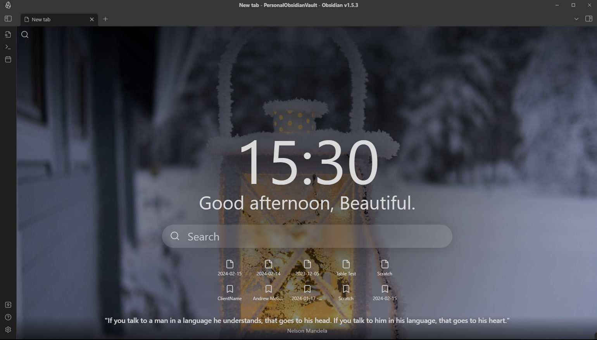

# Obsidian Beautitab

A plugin for Obsidian.MD that creates a customizable new tab view with beautiful backgrounds, quotes, search, and more.

## How to install

Plugin can be installed via the [official community plugins](https://obsidian.md/plugins?id=beautitab).

## Features and customizations

Beautitab is built to be very customizable with every elements being able to be hidden or shown at the users discretion. This includes customization of the rotating backgrounds.

### Top left search

When the top left search icon is clicked, this button opens a search.

The top left search icon can be shown/hidden via settings. Additionally, the behaviour of what occurs when the button is clicked can be configured to open one of a number of plugins.

> [!TIP]
> Another plugin you'd like to see as a provider? Open an issue!

### Time

Displays the current time in the middle of the screen and updates as time passes.

The time can be shown/hidden via settings and configured to show in 12-hour format or 24-hour format.

### Greeting

Displays a greeting in the middle of the screen.

The greeting can be customized via settings or shown/hidden.

### Inline search

When the search box in the middle of the screen is clicked, this button opens a search.

The inline search can be shown/hidden via settings. Additionally, the behaviour of what occurs when the button is clicked can be configured to open one of a number of plugins.

> [!TIP]
> Another plugin you'd like to see as a provider? Open a discussion!

### Recent files

Shows your 5 most recently updated files in the middle of the screen.

The recent files list can be shown/hidden via settings.

### Bookmarks

Shows 5 bookmarks in the middle of the screen, either from all bookmarks or from a specific bookmark group.

The bookmarks list can be shown/hidden via settings.

### Quote

Shows a random quote at the bottom of the screen.

The quote can be shown/hidden via settings. It can also be configured to use the built in quotes, your own custom both, or a mix of both.

### Background

A random background is displayed on the Beautitab screen. This background will remain the same for the remainder of the day or when Obsidian is reloaded/relaunched. Various themes can be selected in settings.

#### Seasons and holidays (_Recommended_)

This specia theme will show diferent images depending on the time of the year. For example, will show fireworks on news years, pumpkins in the fall, and holiday images in December.

> [!TIP]
> If there is a theme you feel we should celebrate in the Seasons and holidays theme, open a discussion!

#### Custom

Will display a new box to provide the URL to your own image.

## Settings

All customizations can be completed within the settings screen.

## Screenshots and examples

## Reporting issues

If you run into any issues with this plugin, please open an issue and incude as much detail as possible, including screenshots.

## Credits

-   Images are pulled from http://www.unsplash.com
-   Quotes are pulled from the quoteable API: https://github.com/lukePeavey/quotable
-   Inspired by the excellent Chrome extension Momentum: https://momentumdash.com/

# Leave a Tip

